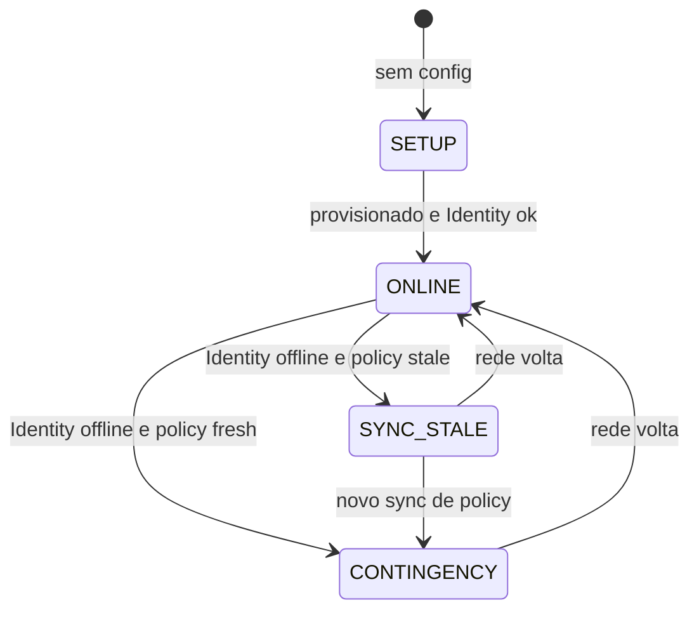

# Modo contingência (online-first + fallback local)

Cenário alvo: **celular com internet (4G)** + **porta sem WAN** no momento do scan.

O appliance tenta sempre o caminho online (source of truth). Se a rede falhar, usa o **último sync de política** local — desde que ainda esteja dentro da validade configurada.

## Estados (`operationMode`)



| Modo | Condição | Passagem |
|------|----------|----------|
| `SETUP` | Appliance não provisionado | Bloqueada (use `/setup`) |
| `ONLINE` | Identity alcançável | Redeem em tempo real → ViaAccess |
| `CONTINGENCY` | Sem Identity + policy fresh | Validação local (ticket assinado — fase 2) |
| `SYNC_STALE` | Sem Identity + policy ausente/expirada | **Bloqueada** |

### Policy fresh

Arquivo `policy-snapshot.json` (padrão `/etc/viaaccess-qr-reader/policy-snapshot.json`):

```json
{
  "syncedAt": "2026-07-10T12:00:00Z",
  "grantVersion": "v42",
  "accessPointSlug": "entrada-principal",
  "trustKeyId": "org-1",
  "memberGrantCount": 128,
  "maxStaleHours": 168
}
```

Fresh = `memberGrantCount > 0` e idade &lt; `maxStaleHours` (padrão 168h / 7 dias).

## Fluxo de scan

```text
POST /scan (ou stdin USB)
    │
    ├─ redeem online (timeout padrão 3s)
    │     └─ OK → scanPath ONLINE → relé / unlock
    │
    └─ falha de rede / timeout
          ├─ mode CONTINGENCY → verify ticket local (fase 2)
          │       └─ OK → scanPath CONTINGENCY → outbox + relé
          └─ mode SYNC_STALE → scanPath BLOCKED (HTTP 503)
```

## GET /health (integrador)

Exemplo em modo contingência:

```json
{
  "ok": true,
  "configured": true,
  "operationMode": "CONTINGENCY",
  "operationModeLabel": "Contingência (validação local, último sync)",
  "identityReachable": false,
  "warning": "Rede indisponível; usando contingência com último sync. Revogações podem atrasar.",
  "contingency": {
    "enabled": true,
    "onlineRedeemTimeoutMs": 3000,
    "maxPolicyStaleHours": 168,
    "ticketVerify": "pending"
  },
  "policySync": {
    "syncedAt": "2026-07-10T09:00:00Z",
    "grantVersion": "v42",
    "memberGrantCount": 128,
    "stale": false,
    "staleAgeHours": 2.5,
    "maxStaleHours": 168
  },
  "outbox": { "pending": 3 },
  "lastScan": {
    "at": "2026-07-10T11:58:00Z",
    "path": "CONTINGENCY",
    "outcome": "ERROR",
    "error": "verificação de ticket assinado ainda não implementada"
  }
}
```

### Como o integrador interpreta

| Campo | Ação |
|-------|------|
| `operationMode: ONLINE` | Normal |
| `operationMode: CONTINGENCY` | Porta pode operar com atraso de revogação; conferir `outbox.pending` |
| `operationMode: SYNC_STALE` | **Urgente:** restaurar rede ou forçar sync de policy |
| `policySync.stale: true` | Sync necessário antes de confiar em contingência |
| `outbox.pending` alto | WAN voltou? aguardar flush automático (fase 2) |

## Configuração

Em `config.json` ou env:

| Campo / env | Padrão | Descrição |
|-------------|--------|-----------|
| `contingency.enabled` / `CONTINGENCY_ENABLED` | `true` | Habilita fallback local |
| `contingency.onlineRedeemTimeoutMs` / `ONLINE_REDEEM_TIMEOUT_MS` | `3000` | Timeout do redeem online |
| `contingency.maxPolicyStaleHours` / `MAX_POLICY_STALE_HOURS` | `168` | Validade do snapshot |

## Roadmap

| Fase | Entrega |
|------|---------|
| **Atual** | Estados, `/health`, online-first + timeout, policy/outbox em disco, stub de ticket |
| **2** | Identity emite ticket assinado no QR; `contingency.Verify` completo |
| **3** | API de sync Identity → appliance; flush outbox → ViaAccess |

## Arquivos

| Caminho | Papel |
|---------|-------|
| `internal/agent/mode.go` | Máquina de estados |
| `internal/agent/state.go` | Snapshot `/health` |
| `internal/policy/store.go` | Snapshot de grants |
| `internal/outbox/store.go` | Fila de eventos |
| `internal/contingency/verify.go` | Validação local (fase 2) |
| `internal/scan/handler.go` | Online-first no scan |
