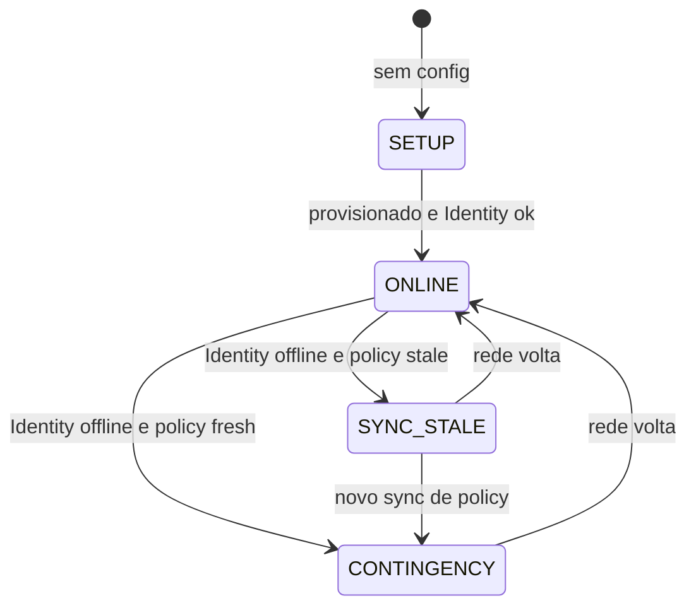

# Modo contingência (online-first + fallback local)

Cenário alvo: **celular com internet (4G)** + **porta sem WAN** no momento do scan.

O appliance tenta sempre o caminho online (source of truth). Se a rede falhar, usa o **último sync de política** local e o **ticket assinado (`st`)** no QR.

## Estados (`operationMode`)



| Modo | Condição | Passagem |
|------|----------|----------|
| `SETUP` | Appliance não provisionado | Bloqueada (use `/setup`) |
| `ONLINE` | Identity alcançável | Redeem em tempo real → ViaAccess |
| `CONTINGENCY` | Sem Identity + policy fresh | Validação local do JWT `st` |
| `SYNC_STALE` | Sem Identity + policy ausente/expirada | **Bloqueada** |

### Policy fresh

Arquivo `policy-snapshot.json` (padrão `/etc/viaaccess-qr-reader/policy-snapshot.json`), preenchido pelo sync automático (`GET /api/bridge/policy-snapshot`):

```json
{
  "syncedAt": "2026-07-10T12:00:00Z",
  "grantVersion": "a1b2c3d4e5f6g7h8",
  "accessPointSlug": "entrada-principal",
  "trustKeyId": "org-example",
  "memberGrantCount": 128,
  "memberIds": ["mem_1", "mem_2"],
  "maxStaleHours": 168,
  "ticketVerify": {
    "alg": "HS256",
    "keyB64": "...",
    "issuer": "viaaccess-identity-passage"
  }
}
```

Fresh = `memberGrantCount > 0`, `ticketVerify` presente e idade &lt; `maxStaleHours` (padrão 168h / 7 dias).

## Fluxo de scan

```text
POST /scan (ou stdin USB)
    │
    ├─ redeem online (timeout padrão 3s)
    │     └─ OK → scanPath ONLINE → relé / unlock
    │
    └─ falha de rede / timeout
          ├─ mode CONTINGENCY → verify JWT st + grant snapshot + anti-replay
          │       └─ OK → scanPath CONTINGENCY → outbox + relé
          └─ mode SYNC_STALE → scanPath BLOCKED (HTTP 503)
```

## Ticket assinado no QR

O app Identity inclui `st` na URL do QR dinâmico:

```text
https://identity.example/r/{intentId}?t={token}&st={jwt}
```

- `t` — redeem online (Identity valida intent + token)
- `st` — JWT HS256 para contingência offline (claims: `sub`, `jti`, `ap`, `org`, `gv`, `exp`)

## Sync e flush (automático)

A cada 60s (quando provisionado), o agent:

1. `GET /api/bridge/policy-snapshot` → atualiza `policy-snapshot.json`
2. `POST /api/bridge/contingency/flush` → envia eventos do outbox para ViaAccess

## GET /health (integrador)

| Campo | Ação |
|-------|------|
| `operationMode: ONLINE` | Normal |
| `operationMode: CONTINGENCY` | Porta opera com atraso de revogação; conferir `outbox.pending` |
| `operationMode: SYNC_STALE` | **Urgente:** restaurar rede ou forçar sync |
| `contingency.ticketVerify: ready` | Verificação local habilitada |
| `outbox.pending` alto | WAN voltou; aguardar flush automático |

## Configuração

| Campo / env | Padrão | Descrição |
|-------------|--------|-----------|
| `contingency.enabled` / `CONTINGENCY_ENABLED` | `true` | Habilita fallback local |
| `contingency.onlineRedeemTimeoutMs` / `ONLINE_REDEEM_TIMEOUT_MS` | `3000` | Timeout do redeem online |
| `contingency.maxPolicyStaleHours` / `MAX_POLICY_STALE_HOURS` | `168` | Validade do snapshot |

## Arquivos

| Caminho | Papel |
|---------|-------|
| `internal/agent/mode.go` | Máquina de estados |
| `internal/contingency/verify.go` | Validação JWT offline |
| `internal/syncclient/client.go` | Policy sync + outbox flush |
| `internal/outbox/store.go` | Fila de eventos com payload |
| `internal/contingency/nonce.go` | Anti-replay por intentId |
